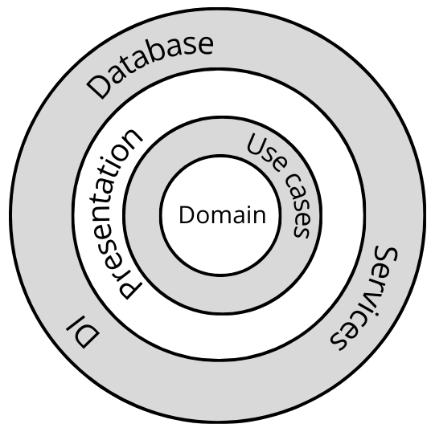

# Backend 

#### Description
ExpressJs server built in Typescript and following Clean Architecture practices.
This application is a simple example aiming to show a set of crud operations, storing the data in a MongoDB instance. It also has a use case to crawl and save feeds retrieved from two important newspapers.

### Architecture diagram
The application architecture was designed based on a Clean Architecture and following SOLID principles. In this way, the structure is simpler to test and maintain. Higher layers are dependant of lower ones, but the opposite is not valid. The Dependency Injector is used to decouple the inverse. dependency.

From higher to lower modules:
- Infrastructure:
  - Database: Interacts with the database instance, in this case, a MongoDB one. Handles connectivity and transactions logic.
  - Services: Module used to interface with external services through HTTP. In this case, it also wraps the crawlers logic.
  - DI: Module used to orchestrate dependencies between application layers. It could be replaced by a DI package.
- Presentation:
  - Rest: This module wraps the REST API, exposing endpoints and validating interfaces. It also manages non business errors.
- Application:
  - Use Cases: Contains all the business flows used in the application.
- Domain:
  - Entities/Interfaces: Defines standard interfaces and business entities. It's the core of the application and it doesn't depend on the implementation mechanisms.

### External Services
Newspapers to crawl:
El País: `www.elpais.com`
El Mundo: `www.elmundo.es`

### API documentation
Accessing to the path `/docs` there's a Swagger document explaining all the available endpoints.
Default development url: `http://localhost:3000/docs`

## Development process
### Launch a MongoDB instance
- Create a local MongoDB instance
    `docker compose up -d database`

### Steps to run the backend in development mode
- Recommended: Install pnpm in your environment 
    `npm i -g pnpm`
- Install dependencies
    `pnpm i`
- Run the server in dev mode
    `pnpm dev`

### Steps to run tests
- Validate and fix the source code using predefined eslint rules
    `pnpm fix:eslint`
- Validate and fix the source code using predefined defined prettier rules
    `pnpm fix:prettier`
- Execute local tests and analyze coverage
    `pnpm fix:prettier`

## Production
### Steps to run in prod mode
- Configure `.env` file using your environments
- Build the the server
    `pnpm build`
- Run built package
    `pnpm serve`

### Steps to run the app using Docker
- Run the backend container. Prerequisite: A database up and running.
- If the database is the same of this docker compose, you have to update the `DATABASE_URI` in `.env` file to `"mongodb://db_alias:27017/daily-trends"`, so the backend container reaches the database ones.
    `docker compose up backend --build -d`